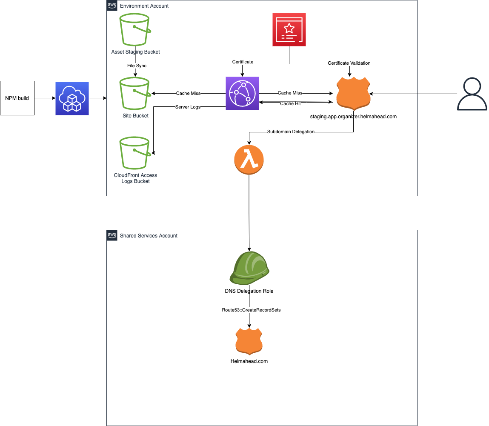

# Observer Frontend Infrastructure
This project contains 2 CDK applications:
    - [`ci-infrastructure`](./bin/ci-infrastructure.ts) creates an IAM role for pipelines to assume during a deployment.
    - [`app-infrastructure`](./bin/app-infrastructure.ts) creates a CloudFront distribution to serve files from an S3 origin. The script also uploads build artifacts into the website bucket.

## Setting up CI for a new environment
- (Optional, if this hasn't already been done): In the bitbucket UI, add a Deployment containing the following variables:
    - AWS_ACCOUNT - the account ID of the target AWS account
    - STAGE - the name of the corresponding stage/environment (i.e., `sandbox`, `staging`, `production`)
- (Optional, if this hasn't already been done): Add the environment's stack properties in [`lib/config.ts`](./lib/config.ts)
    - add your environment's settings in `getCiEnvironment`.
- Add a `ContinuousIntegrationStack` in [`bin/ci-infrastructure.ts`](./bin/ci-infrastructure.ts). Ensure that the stack follows the naming convention `helm-organizer-frontend-ci-${STAGE}`, where `${STAGE}` is the value you added in the first step (e.g., the value of `STAGE` in your Deployment variables).
- In `bitbucket-pipelines.yml` update the `ci-infrastructure` step to deploy CI for your stage.
    - First, in the `definitions` section, add a step that inherits from `*deploy-ci-roles-base`, and sets the `deployment` key to the correct Deployment env. Name it `deploy-ci-roles-${STAGE}`, where `${STAGE}` is the name of your deployment environment.
    - Then, in the `ci-infrastructure` pipeline, add a step to invoke `deploy-ci-roles-${STAGE}`. This will enable pipeline deploys for your stage.
- Push your changes, then manually trigger the `ci-infrastructure` pipeline to provision.

#  Deploying shared services (optional)
Shared services are those deployed into one account, but used by others. For example, top level hosted Zones are shared because they may be deployed into a prod/shared services account, but utilized by services in dev, staging, etc., that need to add a DNS record. If you've got shared services to deploy, continue reading this section.

- Follow the steps above to setup CI infrastructure first.
- Create your stack definition in `lib/`
- Add a stack instance to `bin/shared-infrastructure.ts`. It should adhere to the `${STACK_NAME}-${STAGE}` convention outlined above.
- Update the deployment pipeline to deploy your stack in addition to `helm-tld`.
- Trigger the `custom:shared-infrastructure` build.
- Take note of any resource or account IDs you want to share with other stacks.

# Setting up Application infrastructure for a new environment
- Follow the steps above to set up CI infrastructure first.
- If necessary, add shared services information to `cdk.context.json` under the `sharedServices` object.
- (Optional, if this hasn't already been done): Add the environment's stack properties in [`lib/config.ts`](./lib/config.ts)
    - add your environment's settings in `getApplicationEnvironment`
- Add a `DnsInfrastructureStack` in [`bin/app-infrastructure.ts`](./bin/app-infrastructure.ts). Ensure that the stack follows the naming convention `helm-organizer-frontend-dns-${STAGE}`, where `${STAGE}` is the value you added in the first step (e.g., the value of `STAGE` in your Deployment variables).
- Add an `AppInfrastructureStack` in [`bin/app-infrastructure.ts`](./bin/app-infrastructure.ts). Ensure that the stack follows the naming convention `helm-organizer-frontend-${STAGE}`, where `${STAGE}` is the value you added in the first step (e.g., the value of `STAGE` in your Deployment variables). To enable DNS, set your AppInfrastructureStack's `parentHostedZone` pparameter to your DnsInfrastructureStack's `domain` attribute.
- In `bitbucket-pipelines.yml`, add a step to deploy the application for your stage.
    - First, in the `definitions` section, add a step that inherits from `*deploy-base`, and sets the `deployment` key to the correct Deployment env. Name it `deploy-${STAGE}`, where `${STAGE}` is the name of your deployment environment.
    - Then, in the `pipelines` section, add configuration to deploy your branch to the desired stage(s). You'll need to inherit from the following steps, at minimum:
        - `install-deps`
        - `install-deployment-deps`
        - `deploy-${STAGE}`
            - you can have more than one `deploy-${STAGE}` per branch, but you need to deploy them in order, i.e. pre-production environments before production ones.

## Local Usage
- Run `npm i` and `npm build` from the parent directory to build the asset bundle.
- Set your AWS credentials in the environment.
    - ***Note: using SSO + named profiles from the CLI does not work per https://github.com/aws/aws-cdk/issues/5455. That issue has a variety of workarounds, but the core concept is to extract your temporary credentials from `~/.aws/cli/cache` and export them into the environment (or profile in `~/.aws/config`). In general, though, there should be no reason to run this command locally once CI is wired up.***
- In the infrastructure directory, run `npm i --save-dev` to install the CDK and deployment dependencies.
- Run `bin/deploy -s ${STAGE} -t ${STACK} -a ${APP}`, where:
    - STAGE is the environment to deploy, i.e. sandbox, staging, production, etc.
    - STACK is the name of the stack you want to deploy, without the `STAGE` suffix (i.e. `helm-organizer-dns`, `helm-organizer-frontend`).
    - APP is the CDK app that contains your stacks. This should be the name of a CDK app file in `infrastructure/bin/`, i.e. `app-infrastructure`, or `shared-infrastructure`.

## Architecture Diagram

The `cdk.json` file tells the CDK Toolkit how to execute your app.

## Useful commands

 * `npm run build`   compile typescript to js
 * `npm run watch`   watch for changes and compile
 * `npm run test`    perform the jest unit tests
 * `cdk deploy`      deploy this stack to your default AWS account/region
 * `cdk diff`        compare deployed stack with current state
 * `cdk synth`       emits the synthesized CloudFormation template
